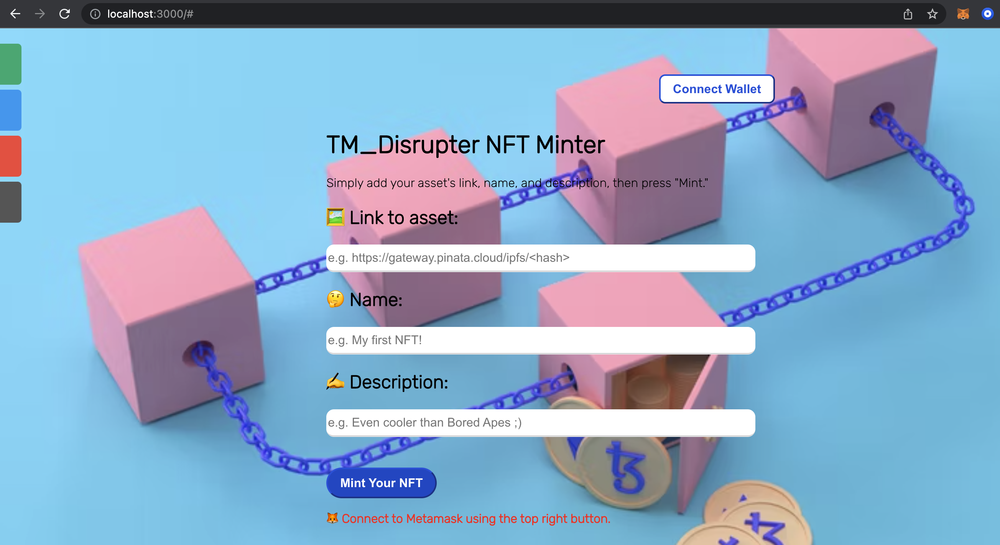

# TMD NFT Minter Tutorial

This project contains the files for [Alchemy's NFT Minter tutorial](https://docs.alchemyapi.io/alchemy/tutorials/nft-minter). We have connected our Smart Contract to our React dApp project by building an NFT Minter using Metamask and Web3.

This React dApp is hosted on Heroku, [check it out](https://tmd-nft.herokuapp.com/)!

If you want to run it locally, please follow the next steps:

- Git clone this repository: `git clone https://github.com/jojomani/tm_disrupter.git`
- Go in to the follwoing directory _/tm_disrupter/nft-web-ui_ and run `npm install`
- After you have downloaded all the package dependencies, run `npm start`

You should see a tab open on your browser, running on *http://localhost:3000/* : 

## And VOILÀ!